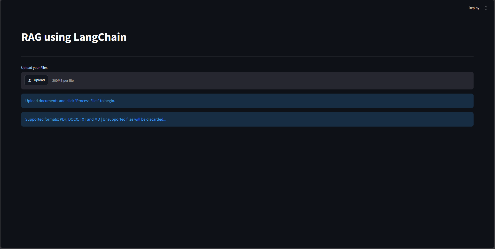
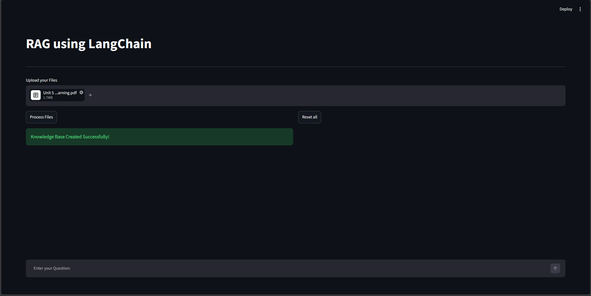
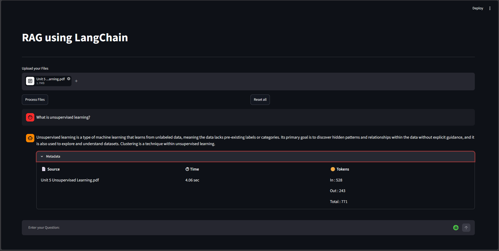

# Advanced Hybrid RAG Chatbot

A production-style Retrieval-Augmented Generation (RAG) application built using **LangChain**, **FAISS**, **BM25**, **Cross-Encoder Reranking**, **Google Gemini 2.5 Flash**, and **Streamlit**.

Unlike a basic RAG implementation, this project combines multiple retrieval techniques, history-aware query reformulation, hybrid search, reranking, and conversation memory to provide highly relevant, context-aware answers from multiple uploaded documents.

---

# Demo







---

# Table of Contents

- Overview
- Features
- System Architecture
- Project Workflow
- Tech Stack
- Retrieval Pipeline
- Project Structure
- Installation
- Usage
- Metadata Display
- Supported File Types
- Retrieval Techniques
- Prompt Engineering
- Conversation Memory
- Performance Improvements
- Future Enhancements
- License

---

# Overview

Retrieval-Augmented Generation (RAG) enhances Large Language Models by retrieving relevant knowledge from user-provided documents before generating responses.

This project allows users to upload multiple documents and chat with them naturally while maintaining conversational context.

Instead of relying solely on semantic similarity, the system combines:

- Dense Retrieval (FAISS Index)
- Sparse Retrieval (BM25)
- Maximum Marginal Relevance (MMR)
- History-aware Query Reformulation
- Cross-Encoder Reranking

to maximize retrieval quality before passing context to Gemini 2.5 Flash.

---

# Features

## Multi-format Document Support

Supports:

- PDF
- DOCX
- TXT
- Markdown (.md)

Multiple documents can be uploaded simultaneously.

---

## Hybrid Retrieval

Instead of relying on a single retriever, the project combines:

- FAISS Vector Search
- BM25 Keyword Search
- Maximum Marginal Relevance (MMR)

Hybrid retrieval improves recall by combining semantic similarity with keyword matching.

---

## History-Aware Retrieval

The retriever understands follow-up questions.

Example:

User:

> What is Machine Learning?

Follow-up:

> What are its advantages?

Instead of retrieving documents using only:

```
What are its advantages?
```

the retriever first reformulates the question using previous conversation history.

---

## Cross-Encoder Reranking

Retrieved chunks are reranked using a Cross-Encoder model.

Benefits:

- Removes irrelevant chunks
- Improves final context quality
- Better answer accuracy

---

## Multi-Document Chat

Users can upload multiple documents.

The chatbot automatically retrieves information from all uploaded files without requiring document selection.

---

## Conversation Memory

Maintains previous conversations.

Only the latest conversation history is sent to the LLM to:

- reduce token usage
- preserve context
- improve follow-up responses

---

## Metadata Display

Every generated response displays:

- Source document(s)
- Response generation time
- Input tokens
- Output tokens
- Total tokens

---

## Streaming Responses

Responses are streamed progressively for a natural conversational experience.

---

## Error Handling

Gracefully handles:

- Unsupported file formats
- Empty document uploads
- Gemini Resource exhaustion
- Processing failures

---

## Reset Knowledge Base

Allows users to clear:

- uploaded documents
- vector database
- conversation history

with a single click.

---

# System Architecture

```
                User Uploads Documents
                         │
                         ▼
                 Document Loaders
                         │
                         ▼
             Recursive Character Splitter
                         │
                         ▼
             HuggingFace Embeddings
                         │
                         ▼
              	FAISS Vector Index
                         │
                         ▼
                 Hybrid Retrieval
         ┌──────────────┴──────────────┐
         │                             │
     FAISS (MMR)                   BM25
         │                             │
         └──────────────┬──────────────┘
                        ▼
              History-Aware Retriever
                        ▼
              Cross-Encoder Reranker
                        ▼
                 Top Relevant Chunks
                        ▼
                Prompt Construction
                        ▼
               Gemini 2.5 Flash LLM
                        ▼
               Streamlit Chat Interface
```

---

# Project Workflow

1. Upload documents.
2. Process documents.
3. Split documents into chunks.
4. Generate embeddings.
5. Build FAISS index.
6. Create BM25 retriever.
7. Combine retrievers.
8. Reformulate follow-up queries.
9. Retrieve relevant chunks.
10. Rerank retrieved chunks.
11. Construct prompt.
12. Generate answer using Gemini.
13. Display answer with metadata.

---

# Tech Stack

## Language

- Python

## Framework

- LangChain

## LLM

- Google Gemini 2.5 Flash

## Embedding Model

- sentence-transformers
- all-MiniLM-L6-v2

Embedding Dimension:

384

---

## Vector Search

FAISS

Index Type:

Flat Index (LangChain FAISS)

Similarity Metric:

Cosine Similarity
(L2 normalization performed internally)

---

## Sparse Retrieval

BM25

---

## Reranker

CrossEncoder

---

## UI

Streamlit

---

## Project Structure

```text
Advanced-Hybrid-RAG/
│
├── ingestion/                     # Document ingestion pipeline
│   ├── loaders.py                 # Multi-format document loaders
│   ├── splitter.py                # Text chunking
│   ├── embeddings.py              # Embedding generation
│   └── embedding_model.py         # HuggingFace embedding model
│
├── retrieval/                     # Retrieval pipeline
│   ├── retriever.py               # History-aware retrieval
│   ├── prompt_response.py         # Prompt construction & response generation
│   └── ensemble_retriever.py      # Hybrid (FAISS + BM25 + Reranker)
│
├── models/
│   ├── llm_model.py               # Gemini LLM configuration
│   └── transformer.py             # CrossEncoder reranker
│
├── UI.py                          # Streamlit application
├── requirements.txt               # Python dependencies
├── README.md                      # Project documentation
└── .gitignore                     # Git ignore rules
```

---

# Installation

Clone repository

```bash
git clone <repository-url>
```

Create virtual environment

```bash
python -m venv venv
```

Activate environment

Windows

```bash
venv\Scripts\activate
```

Install dependencies

```bash
pip install -r requirements.txt
```

Create a `.env` file

```
GEMINI_API_KEY=YOUR_API_KEY
```

Run

```bash
streamlit run UI.py
```

---

# Performance Improvements

Compared to a basic RAG system, this project adds:

- Hybrid Retrieval
- History-Aware Retrieval
- MMR
- BM25
- Cross-Encoder Reranking
- Streaming Responses
- Conversation Memory
- Metadata Tracking
- Error Handling

These enhancements significantly improve retrieval quality, contextual understanding, and overall user experience.

---

# Future Enhancements

- OCR support for scanned PDFs
- Table extraction
- Image understanding with multimodal models
- Citation highlighting inside answers
- Persistent vector database
- User authentication
- Cloud deployment
- Docker support

---

# License

This project is intended for educational and portfolio purposes.